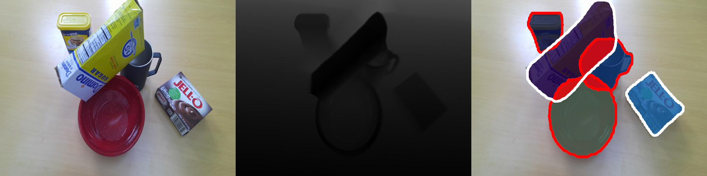

# Unseen Object Amodal Instance Segmentation (UOAIS)

Seunghyeok Back, Joosoon Lee, Taewon Kim, Sangjun Noh, Raeyoung Kang, Seongho Bak, Kyoobin Lee 


This repository contains source codes for the paper "Unseen Object Amodal Instance Segmentation via Hierarchical Occlusion Modeling."

[[Paper]](https://arxiv.org/abs/2109.11103) [[Project Website]](https://sites.google.com/view/uoais) [[Video]](https://youtu.be/rDTmXu6BhIU) 


## Updates & TODO Lists
- [X] (2021.09.26) UOAIS-Net has been released 
- [ ] Add train and evaluation code
- [ ] Release synthetic dataset (UOAIS-Sim) and amodal annotation (OSD-Amodal)
- [ ] Add ROS inference node


## Getting Started

### Environment Setup

Tested on Titan RTX with python 3.7, pytorch 1.8.0, torchvision 0.9.0, CUDA 10.2.

1. Download
```
git clone https://github.com/gist-ailab/uoais.git
cd uoais
mkdir output
```
Download the checkpoint at [GDrive](https://drive.google.com/drive/folders/1D5hHFDtgd5RnX__55MmpfOAM83qdGYf0?usp=sharing) and move the downloaded folders to the `output` folder

2. Set up a python environment
```
conda create -n uoais python=3.7
conda activate uoais
pip install torch torchvision 
pip install shapely torchfile opencv-python pyfastnoisesimd rapidfuzz
```
3. Install [detectron2](https://detectron2.readthedocs.io/en/latest/tutorials/install.html#install-pre-built-detectron2-linux-only)
4. Build and install custom [AdelaiDet](https://github.com/aim-uofa/AdelaiDet)
```
python setup.py build develop 
```

### Run with Sample Data

UOAIS-Net (RGB-D)
```
python tools/run_sample_data.py
```



## License

This repository is released under the MIT license.


## Citation
If you use our work in a research project, please cite our work:
```
@misc{back2021unseen,
      title={Unseen Object Amodal Instance Segmentation via Hierarchical Occlusion Modeling}, 
      author={Seunghyeok Back and Joosoon Lee and Taewon Kim and Sangjun Noh and Raeyoung Kang and Seongho Bak and Kyoobin Lee},
      year={2021},
      eprint={2109.11103},
      archivePrefix={arXiv},
      primaryClass={cs.RO}
}
```
